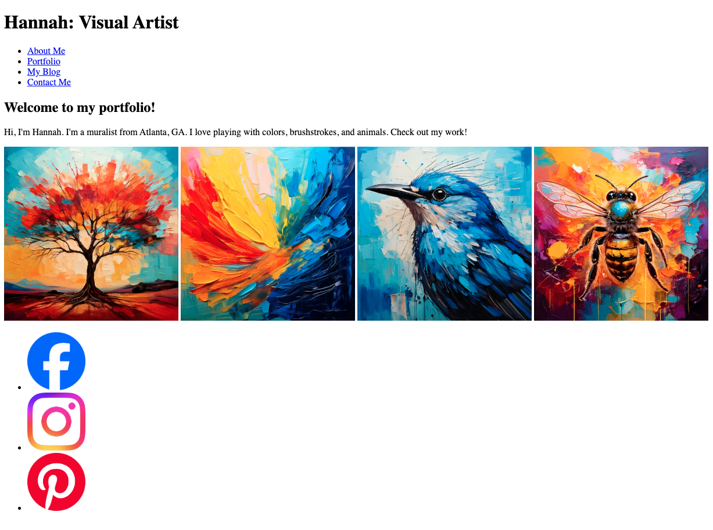
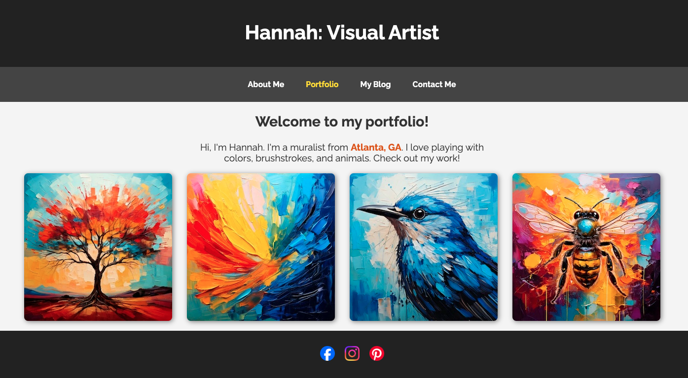
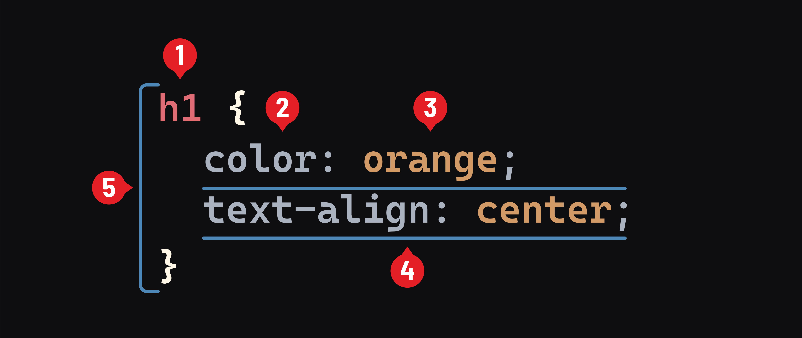
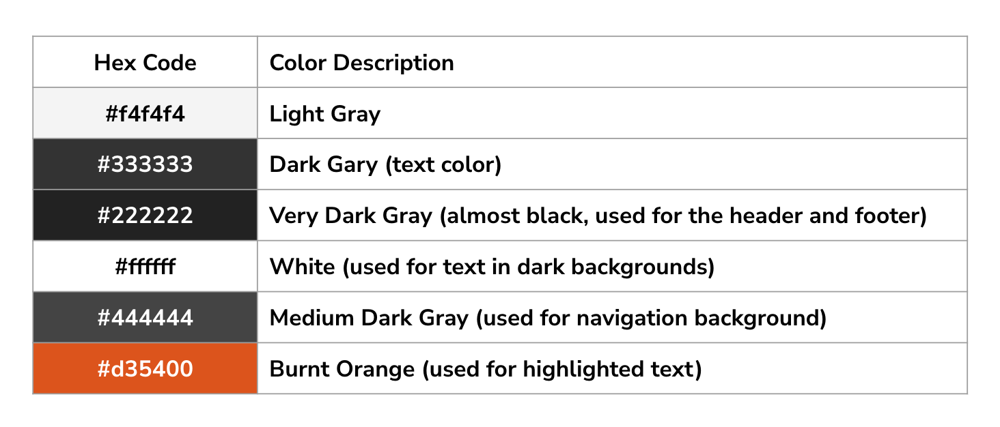

<textarea id="source">

<h1 class="slide-header">Introduction to CSS</h1>

<span id=time-estimate class="color-grey-500">20 mins</span>

<p id="lesson-description">
If HTML provides the structure of your website—like the foundation and framework of a house—CSS is what styles and decorates it, making it visually appealing and user-friendly. In this lesson, we’ll explore what CSS is, why it’s essential, and how it allows you to control the look and feel of your web pages.
</p>

<h5 id="topics-header" class="color-grey-500">Topics</h5>

How CSS Works

<hr>

CSS Syntax

<hr>

<a href="./assets/introduction_to_css_study_guide.pdf" target="_blank" download="introduction_to_css_study_guide.pdf" class="ant-btn" data-trackable="true" data-track-category="study guide" data-track-section="lesson page" data-track-action="download study guide"><span role="img" class="anticon"><svg viewBox="0 0 16 16" width="1em" height="1em" fill="currentColor" aria-hidden="true" focusable="false" class=""><g class="download_svg__nc-icon-wrapper"><path d="M8 12c.3 0 .5-.1.7-.3L14.4 6 13 4.6l-4 4V0H7v8.6l-4-4L1.6 6l5.7 5.7c.2.2.4.3.7.3z"></path><path data-color="color-2" d="M1 14h14v2H1z"></path></g></svg></span><span>Download Study Guide</span></a>

---

<h1 class="slide-header">Learning Objectives</h1>

<p>By the end of this lesson, you'll be able to:</p>

<ul>
  <li>Describe what CSS is and why it’s important to web design.</li>
  <li>Explain how CSS interacts with HTML to visually render a webpage.</li>
  <li>Recognize the structure of CSS rules.</li>
</ul>
  
---
  
<h1 class="slide-header">Let's Get To Work</h1>

As you practice CSS, you’ll be working with your first client—Hannah, a mural artist whose work is popular on social media. She knows you’ve been learning web development and has asked for your help in improving her homepage.

By the end of this unit, you’ll transform her site into something polished and professional. Who knows? With your skills, Hannah’s followers might start asking for your help, too!

Here’s what her website looks like right now—it’s simple, but it has a lot of potential!


  
---
  
<h1 class="slide-header">Hannah's HTML</h1>

Hannah shared her code with you, simplifying it down to just the HTML so you can focus on styling it with CSS. She’s also created a design for you to follow.

This is the final look she wants to achieve:


  
---

<h1 class="slide-header">In the Beginning (of the Internet)</h1>
<!--
  WISTIA EXAMPLE. REPLACE 11dit621rx with the id
-->
<div class="wistia_embed wistia_async_bblwz9u0rm wistia_embed_initialized" id="wistia-bblwz9u0rm"
  style="width: 100%; height: 90%;">
  <div id="wistia_chrome_23" class="w-chrome notranslate" tabindex="-1">
    <div id="wistia_grid_57_wrapper" style="display: block; width: 630px; height: 354.375px;">
      <div id="wistia_grid_57_above" style="height: 0px; font-size: 0px; line-height: 0px;"> </div>
      <div id="wistia_grid_57_main" style="width: 630px; left: 0px; height: 354.375px; margin-top: 0px;">
        <div id="wistia_grid_57_center" style="width: 100%; height: 100%;">
          <div class="w-video-wrapper w-css-reset"
            style="height: 100%; position: absolute; top: 0px; width: 100%; opacity: 1;">
            <video id="wistia_simple_video_135" crossorigin="anonymous"
              poster="https://fast.wistia.com/assets/images/blank.gif" aria-label="Video" controlslist="nodownload"
              playsinline="" preload="auto" type="video/m3u8" x-webkit-airplay="allow"
              style="background: transparent; display: block; height: 100%; max-height: none; max-width: none; position: static; visibility: visible; width: 100%; object-fit: contain;"></video>
          </div>
          <div class="w-ui-container"
            style="height: 100%; left: 0px; position: absolute; top: 0px; width: 100%; opacity: 1;">
            <div class="w-vulcan-v2 w-css-reset" id="w-vulcan-v2-56"
              style="border-radius: 0px; box-sizing: border-box; cursor: default; direction: ltr; height: 100%; left: 0px; position: absolute; visibility: visible; top: 0px; width: 100%;">
              <div class="w-vulcan--background w-css-reset"
                style="height: 100%; left: 0px; position: absolute; top: 0px; width: 100%;">
                <div class="w-css-reset" data-handle="statusBar"></div>
                <div class="w-css-reset" data-handle="backgroundFocus"><button
                    aria-label="Play Video: A Brief History of the Web" class="w-css-reset w-vulcan-v2-button"
                    tabindex="0" style="width: 0px; height: 0px; pointer-events: none;"></button></div>
              </div>
              <div aria-live="polite" class="w-vulcan--aria-live w-css-reset" aria-atomic="true"
                style="position: absolute; left: -99999em;"></div>
              <div class="w-vulcan-overlays-table w-css-reset"
                style="display: table; pointer-events: none; position: absolute; width: 100%;">
                <div class="w-vulcan-overlays--left w-css-reset"
                  style="display: table-cell; vertical-align: top; position: relative; width: 0px;">
                  <div class="w-css-reset" style="height: 321.375px;"></div>
                </div>
                <div class="w-vulcan-overlays--center w-css-reset"
                  style="display: table-cell; vertical-align: top; position: relative; width: 100%;">
                  <div class="w-css-reset" style="height: 321.375px;">
                    <div class="w-css-reset" data-handle="bigPlayButton" style="pointer-events: auto;">
                      <div class="w-bpb-wrapper w-css-reset w-css-reset-tree"
                        style="border-radius: 0px; display: none; left: calc(50%); margin-left: -61.5234px; margin-top: -39.375px; overflow: hidden; position: absolute; top: calc(50% + 0px);">
                        <button class="w-big-play-button w-css-reset-button-important w-vulcan-v2-button" tabindex="0"
                          type="button" style="cursor: pointer; height: 78.75px; box-shadow: none; width: 123.047px;">
                          <div
                            style="background: rgb(1, 121, 145); display: block; left: 0px; height: 78.75px; mix-blend-mode: darken; position: absolute; top: 0px; width: 123.047px;">
                          </div>
                          <div
                            style="background-color: rgba(1, 121, 145, 0.7); height: 78.75px; left: 0px; position: absolute; top: 0px; transition: background-color 150ms ease 0s; width: 123.047px;">
                          </div><svg x="0px" y="0px" viewBox="0 0 125 80" enable-background="new 0 0 125 80"
                            aria-hidden="true" alt=""
                            style="fill: rgb(255, 255, 255); height: 78.75px; left: 0px; stroke-width: 0px; top: 0px; width: 100%; position: absolute;">
                            <rect fill-rule="evenodd" clip-rule="evenodd" fill="none" width="125" height="80"></rect>
                            <polygon fill-rule="evenodd" clip-rule="evenodd" fill="#FFFFFF" points="53,22 53,58 79,40">
                            </polygon>
                          </svg>
                        </button>
                      </div>
                    </div>
                    <div class="w-css-reset" data-handle="clickForSoundButton" style="pointer-events: auto;">
                    <div class="w-css-reset w-css-reset-tree" data-handle="click-for-sound-backdrop"
                      style="display: none; height: 100%; left: 0px; pointer-events: auto; position: absolute; top: 0px; width: 100%;">
                      <button aria-label="Click for sound" class="w-vulcan-v2-button click-for-sound-btn"
                        style="background: rgba(0, 0, 0, 0.8); border: 2px solid transparent; border-radius: 60px; cursor: pointer; display: flex; justify-content: space-between; align-items: center; outline: none; pointer-events: auto; position: absolute; right: 20.1484px; top: 20.1484px; max-width: 589.703px;">
                        <div
                          style="display: flex; align-items: center; justify-content: flex-end; white-space: nowrap; overflow: hidden; max-width: 0px; transition: max-width 200ms ease 0s;">
                          <span
                            style="color: rgb(255, 255, 255); font-family: WistiaPlayerInter, Helvetica, sans-serif; font-size: 15px; font-weight: 500; padding-left: 1em; white-space: nowrap; overflow: hidden; text-overflow: ellipsis; max-width: 630px;">Click
                            for sound</span>
                        </div><svg viewBox="0 0 237 237" width="51.6796875" height="51.6796875"></svg>
                      </button>
                  </div>
                  </div>
                  </div>
                </div>
              </div>
            </div>
          </div>
        </div>
      </div>
    </div>
  </div>
</div>
<!-- YOUTUBE -->
<!-- VIMEO -->

<details>
  <summary>Transcript</summary>
  <p class="transcript-text">
  A long time ago, in a far away land (1994, Norway), websites were dull and boring because they didn’t have any “style.”

At the time, computer text was mostly monotone and hard to read. The internet was slow, so hardly anyone used images, and there weren’t many common layouts to help users navigate websites.

One day, CSS inventor Håkon Lie was lamenting this fact, wishing he could make the web look “more like a newspaper.” He wanted to give users the ability to style their HTML any way they wanted. “Perhaps they’d like to spice things up, add a little color...”

Luckily, Håkon knew the right people. He worked at CERN with his friend Tim Berners-Lee, the original inventor of the World Wide Web. Håkon proposed that the internet would benefit from a single unifying standard for rendering text, color, and images across different web browsers.

He called it “CSS” — aka, Cascading Style Sheets.

Håkon worked with the web browser inventors, including Bert Bos and the World Wide Web Consortium, to implement CSS, which quickly became a great success!

Today, CSS is used for a wide variety of tasks, including responsive web design, usability, and localization. It offers a scalable, versatile framework that simplifies the task of creating engaging, readable, and — yes — stylish online content.

  </p>
</details>
  
---
  
<h1 class="slide-header">Knowledge Check</h1>

Which of the following functionalities are controlled by CSS?

<fieldset>
  <legend>Please select all that apply</legend>
  <input type="checkbox" id="uniqueAnswer2" name="unique2" /><label for="uniqueAnswer2">Creating a pop-up box that appears when a user clicks a button.</label><br />
  <input type="checkbox" id="uniqueAnswer" name="unique" correct="true"/><label for="uniqueAnswer">Developing a website that looks good on desktop, tablets, and mobile devices.</label><br />
  <input type="checkbox" id="uniqueAnswer3" name="unique3" /><label for="uniqueAnswer3">Retrieving information from the proper data sources.</label><br />
  <input type="checkbox" id="uniqueAnswer4" name="unique4" correct="true"/><label for="uniqueAnswer4">Ensuring that all of a page’s components look and feel consistent.</label><br />
  <input type="checkbox" id="uniqueAnswer5" name="unique5" /><label for="uniqueAnswer5">Adding content to a webpage.</label><br />
</fieldset>

<button class="ant-btn ant-btn-primary multiple-choice-checkbox-submit">Submit Answer</button>

---

<h1 class="slide-header">What Does CSS Actually Do?</h1>

<div class="wistia_embed wistia_async_5a1ifelknh wistia_embed_initialized" id="wistia-5a1ifelknh"
  style="width: 100%; height: 90%;">
  <div id="wistia_chrome_23" class="w-chrome notranslate" tabindex="-1">
    <div id="wistia_grid_57_wrapper" style="display: block; width: 630px; height: 354.375px;">
      <div id="wistia_grid_57_above" style="height: 0px; font-size: 0px; line-height: 0px;"> </div>
      <div id="wistia_grid_57_main" style="width: 630px; left: 0px; height: 354.375px; margin-top: 0px;">
        <div id="wistia_grid_57_center" style="width: 100%; height: 100%;">
          <div class="w-video-wrapper w-css-reset"
            style="height: 100%; position: absolute; top: 0px; width: 100%; opacity: 1;">
            <video id="wistia_simple_video_135" crossorigin="anonymous"
              poster="https://fast.wistia.com/assets/images/blank.gif" aria-label="Video" controlslist="nodownload"
              playsinline="" preload="auto" type="video/m3u8" x-webkit-airplay="allow"
              style="background: transparent; display: block; height: 100%; max-height: none; max-width: none; position: static; visibility: visible; width: 100%; object-fit: contain;"></video>
          </div>
          <div class="w-ui-container"
            style="height: 100%; left: 0px; position: absolute; top: 0px; width: 100%; opacity: 1;">
            <div class="w-vulcan-v2 w-css-reset" id="w-vulcan-v2-56"
              style="border-radius: 0px; box-sizing: border-box; cursor: default; direction: ltr; height: 100%; left: 0px; position: absolute; visibility: visible; top: 0px; width: 100%;">
              <div class="w-vulcan--background w-css-reset"
                style="height: 100%; left: 0px; position: absolute; top: 0px; width: 100%;">
                <div class="w-css-reset" data-handle="statusBar"></div>
                <div class="w-css-reset" data-handle="backgroundFocus"><button
                    aria-label="Play Video: A Brief History of the Web" class="w-css-reset w-vulcan-v2-button"
                    tabindex="0" style="width: 0px; height: 0px; pointer-events: none;"></button></div>
              </div>
              <div aria-live="polite" class="w-vulcan--aria-live w-css-reset" aria-atomic="true"
                style="position: absolute; left: -99999em;"></div>
              <div class="w-vulcan-overlays-table w-css-reset"
                style="display: table; pointer-events: none; position: absolute; width: 100%;">
                <div class="w-vulcan-overlays--left w-css-reset"
                  style="display: table-cell; vertical-align: top; position: relative; width: 0px;">
                  <div class="w-css-reset" style="height: 321.375px;"></div>
                </div>
                <div class="w-vulcan-overlays--center w-css-reset"
                  style="display: table-cell; vertical-align: top; position: relative; width: 100%;">
                  <div class="w-css-reset" style="height: 321.375px;">
                    <div class="w-css-reset" data-handle="bigPlayButton" style="pointer-events: auto;">
                      <div class="w-bpb-wrapper w-css-reset w-css-reset-tree"
                        style="border-radius: 0px; display: none; left: calc(50%); margin-left: -61.5234px; margin-top: -39.375px; overflow: hidden; position: absolute; top: calc(50% + 0px);">
                        <button class="w-big-play-button w-css-reset-button-important w-vulcan-v2-button" tabindex="0"
                          type="button" style="cursor: pointer; height: 78.75px; box-shadow: none; width: 123.047px;">
                          <div
                            style="background: rgb(1, 121, 145); display: block; left: 0px; height: 78.75px; mix-blend-mode: darken; position: absolute; top: 0px; width: 123.047px;">
                          </div>
                          <div
                            style="background-color: rgba(1, 121, 145, 0.7); height: 78.75px; left: 0px; position: absolute; top: 0px; transition: background-color 150ms ease 0s; width: 123.047px;">
                          </div><svg x="0px" y="0px" viewBox="0 0 125 80" enable-background="new 0 0 125 80"
                            aria-hidden="true" alt=""
                            style="fill: rgb(255, 255, 255); height: 78.75px; left: 0px; stroke-width: 0px; top: 0px; width: 100%; position: absolute;">
                            <rect fill-rule="evenodd" clip-rule="evenodd" fill="none" width="125" height="80"></rect>
                            <polygon fill-rule="evenodd" clip-rule="evenodd" fill="#FFFFFF" points="53,22 53,58 79,40">
                            </polygon>
                          </svg>
                        </button>
                      </div>
                    </div>
                    <div class="w-css-reset" data-handle="clickForSoundButton" style="pointer-events: auto;">
                    <div class="w-css-reset w-css-reset-tree" data-handle="click-for-sound-backdrop"
                      style="display: none; height: 100%; left: 0px; pointer-events: auto; position: absolute; top: 0px; width: 100%;">
                      <button aria-label="Click for sound" class="w-vulcan-v2-button click-for-sound-btn"
                        style="background: rgba(0, 0, 0, 0.8); border: 2px solid transparent; border-radius: 60px; cursor: pointer; display: flex; justify-content: space-between; align-items: center; outline: none; pointer-events: auto; position: absolute; right: 20.1484px; top: 20.1484px; max-width: 589.703px;">
                        <div
                          style="display: flex; align-items: center; justify-content: flex-end; white-space: nowrap; overflow: hidden; max-width: 0px; transition: max-width 200ms ease 0s;">
                          <span
                            style="color: rgb(255, 255, 255); font-family: WistiaPlayerInter, Helvetica, sans-serif; font-size: 15px; font-weight: 500; padding-left: 1em; white-space: nowrap; overflow: hidden; text-overflow: ellipsis; max-width: 630px;">Click
                            for sound</span>
                        </div><svg viewBox="0 0 237 237" width="51.6796875" height="51.6796875"></svg>
                      </button>
                  </div>
                  </div>
                  </div>
                </div>
              </div>
            </div>
          </div>
        </div>
      </div>
    </div>
  </div>
</div>
<!-- YOUTUBE -->
<!-- VIMEO -->

<details>
<summary>Transcript</summary>
  <p class="transcript-text">
    CSS refers to Cascading. Style. Sheets.

    “Style sheets” refers to how CSS code is stored in — you guessed it — a sheet listing different style rules. These rules determine how your HTML content will be displayed by web browsers across different devices.

    The term “cascading” alludes to the way water falls down a waterfall. It was Håkon Lie’s (Remember him?) way of describing the logic of CSS, which falls gracefully through multiple sheets to ensure a consistent look and feel.

    You see, web browsers are not all the same — I know, you’re shocked! Some web browsers are older, some are pickier, and some are built for speed.

    CSS provides “cascading” logic so that your HTML style rules work the way you want, no matter which browser you use. CSS rules cascade, or “fall gracefully,” as web browsers implement them in a logical, hierarchical manner. For example, CSS lets you prioritize different rules for different screen sizes. You can also use CSS to design backup rules so that if some of your styles don’t work, your content will still be displayed as you intended.

  </p>
</details>
  
---
  
<h1 class="slide-header">Internal and External CSS</h1>
  
There are two main ways to add CSS to a website:

- **Internal CSS** – This means writing CSS inside a `<style>` tag within your HTML file. Since the CSS is placed inside the same file as your content, it’s called _internal CSS_.
- **External CSS** – This involves writing CSS in a separate file and linking it to your HTML using a `<link>` tag. This method is called _external CSS_, and it’s the most common approach for real-world projects.

**Why Use External CSS?**

Keeping CSS in a separate file helps keep your code organized, especially as your website grows with more styles and structure. It also makes it easier to update and maintain your design.

**How We’ll Apply CSS**

For our project with Hannah, we’ll be adding styles in the **CSS panel** of the CodePen code editor. The connection between the HTML and CSS has already been set up for you, so you don’t need to worry about adding `<style>` or `<link>` tags—just focus on writing your CSS!

---

<h1 class="slide-header">Our First CSS Rule</h1>

Now, let’s give Hannah’s website its first _CSS rule_.

**1. In your CodePen, add the following code in the `CSS` panel:**

```css
header {
  background-color: #222222;
  color: #ffffff;
}
```

**Pro tip**: Make sure to include all punctuation, line breaks, and indentation! This makes your code more readable and ensures that it will run correctly.

<iframe   sandbox="allow-scripts allow-top-navigation allow-top-navigation-by-user-activation allow-forms allow-popups allow-same-origin"  height="400" style="width: 100%;" scrolling="no" title="Intro to CSS Hannah's Site 1" src="https://codepen.io/GAmarketing/embed/JojNmda?default-tab=css%2Cresult&editable=true" frameborder="no" loading="lazy" allowtransparency="true" allowfullscreen="true">
  See the Pen <a href="https://codepen.io/GAmarketing/pen/JojNmda">
  Our First CSS Rule</a> by General Assembly (<a href="https://codepen.io/GAmarketing">@GAmarketing</a>)
  on <a href="https://codepen.io">CodePen</a>.
</iframe>
  
---
  
<h1 class="slide-header">Using CSS to Style HTML</h1>

<div class="wistia_embed wistia_async_0bcgeyr6s0 wistia_embed_initialized" id="wistia-0bcgeyr6s0"
  style="width: 100%; height: 90%;">
  <div id="wistia_chrome_23" class="w-chrome notranslate" tabindex="-1">
    <div id="wistia_grid_57_wrapper" style="display: block; width: 630px; height: 354.375px;">
      <div id="wistia_grid_57_above" style="height: 0px; font-size: 0px; line-height: 0px;"> </div>
      <div id="wistia_grid_57_main" style="width: 630px; left: 0px; height: 354.375px; margin-top: 0px;">
        <div id="wistia_grid_57_center" style="width: 100%; height: 100%;">
          <div class="w-video-wrapper w-css-reset"
            style="height: 100%; position: absolute; top: 0px; width: 100%; opacity: 1;">
            <video id="wistia_simple_video_135" crossorigin="anonymous"
              poster="https://fast.wistia.com/assets/images/blank.gif" aria-label="Video" controlslist="nodownload"
              playsinline="" preload="auto" type="video/m3u8" x-webkit-airplay="allow"
              style="background: transparent; display: block; height: 100%; max-height: none; max-width: none; position: static; visibility: visible; width: 100%; object-fit: contain;"></video>
          </div>
          <div class="w-ui-container"
            style="height: 100%; left: 0px; position: absolute; top: 0px; width: 100%; opacity: 1;">
            <div class="w-vulcan-v2 w-css-reset" id="w-vulcan-v2-56"
              style="border-radius: 0px; box-sizing: border-box; cursor: default; direction: ltr; height: 100%; left: 0px; position: absolute; visibility: visible; top: 0px; width: 100%;">
              <div class="w-vulcan--background w-css-reset"
                style="height: 100%; left: 0px; position: absolute; top: 0px; width: 100%;">
                <div class="w-css-reset" data-handle="statusBar"></div>
                <div class="w-css-reset" data-handle="backgroundFocus"><button
                    aria-label="Play Video: A Brief History of the Web" class="w-css-reset w-vulcan-v2-button"
                    tabindex="0" style="width: 0px; height: 0px; pointer-events: none;"></button></div>
              </div>
              <div aria-live="polite" class="w-vulcan--aria-live w-css-reset" aria-atomic="true"
                style="position: absolute; left: -99999em;"></div>
              <div class="w-vulcan-overlays-table w-css-reset"
                style="display: table; pointer-events: none; position: absolute; width: 100%;">
                <div class="w-vulcan-overlays--left w-css-reset"
                  style="display: table-cell; vertical-align: top; position: relative; width: 0px;">
                  <div class="w-css-reset" style="height: 321.375px;"></div>
                </div>
                <div class="w-vulcan-overlays--center w-css-reset"
                  style="display: table-cell; vertical-align: top; position: relative; width: 100%;">
                  <div class="w-css-reset" style="height: 321.375px;">
                    <div class="w-css-reset" data-handle="bigPlayButton" style="pointer-events: auto;">
                      <div class="w-bpb-wrapper w-css-reset w-css-reset-tree"
                        style="border-radius: 0px; display: none; left: calc(50%); margin-left: -61.5234px; margin-top: -39.375px; overflow: hidden; position: absolute; top: calc(50% + 0px);">
                        <button class="w-big-play-button w-css-reset-button-important w-vulcan-v2-button" tabindex="0"
                          type="button" style="cursor: pointer; height: 78.75px; box-shadow: none; width: 123.047px;">
                          <div
                            style="background: rgb(1, 121, 145); display: block; left: 0px; height: 78.75px; mix-blend-mode: darken; position: absolute; top: 0px; width: 123.047px;">
                          </div>
                          <div
                            style="background-color: rgba(1, 121, 145, 0.7); height: 78.75px; left: 0px; position: absolute; top: 0px; transition: background-color 150ms ease 0s; width: 123.047px;">
                          </div><svg x="0px" y="0px" viewBox="0 0 125 80" enable-background="new 0 0 125 80"
                            aria-hidden="true" alt=""
                            style="fill: rgb(255, 255, 255); height: 78.75px; left: 0px; stroke-width: 0px; top: 0px; width: 100%; position: absolute;">
                            <rect fill-rule="evenodd" clip-rule="evenodd" fill="none" width="125" height="80"></rect>
                            <polygon fill-rule="evenodd" clip-rule="evenodd" fill="#FFFFFF" points="53,22 53,58 79,40">
                            </polygon>
                          </svg>
                        </button>
                      </div>
                    </div>
                    <div class="w-css-reset" data-handle="clickForSoundButton" style="pointer-events: auto;">
  <div class="w-css-reset w-css-reset-tree" data-handle="click-for-sound-backdrop"
    style="display: none; height: 100%; left: 0px; pointer-events: auto; position: absolute; top: 0px; width: 100%;">
    <button aria-label="Click for sound" class="w-vulcan-v2-button click-for-sound-btn"
      style="background: rgba(0, 0, 0, 0.8); border: 2px solid transparent; border-radius: 60px; cursor: pointer; display: flex; justify-content: space-between; align-items: center; outline: none; pointer-events: auto; position: absolute; right: 20.1484px; top: 20.1484px; max-width: 589.703px;">
      <div
        style="display: flex; align-items: center; justify-content: flex-end; white-space: nowrap; overflow: hidden; max-width: 0px; transition: max-width 200ms ease 0s;">
        <span
          style="color: rgb(255, 255, 255); font-family: WistiaPlayerInter, Helvetica, sans-serif; font-size: 15px; font-weight: 500; padding-left: 1em; white-space: nowrap; overflow: hidden; text-overflow: ellipsis; max-width: 630px;">Click
          for sound</span>
      </div><svg viewBox="0 0 237 237" width="51.6796875" height="51.6796875"></svg>
    </button>
</div>
</div>
</div>
                </div>
              </div>
            </div>
          </div>
        </div>
      </div>
    </div>
  </div>
</div>
<!-- YOUTUBE -->
<!-- VIMEO -->

<details>
  <summary>Transcript</summary>

  <p class="transcript-text">
  “h1” is an HTML tag found in an HTML file.

HTML is styled with CSS.

In this CSS declaration, we are telling CSS to style any HTML text tagged as an "h1".

To start, we define our selector. This tells our code which HTML ingredient should be styled by our CSS recipe.

Next, we set a parameter for our code using curly braces. These contain the styles we want CSS to apply to our selector.

Finally, we state the style we want to declare within our curly braces. For now, we’ve included a single instruction.

A CSS declaration is broken into two parts: a property and a value. A “property” is any HTML element that you wish to style. A “value” is any particular style you wish to apply. Whenever we write CSS, we’ll use our declaration to define what HTML element should be changed and how to change it.

  </p>
</details>

---

<h1 class='slide-header'>CSS Syntax</h1>



CSS is made up of rules that tell the browser how to style elements on a webpage. Each rule follows a simple pattern:

1. **Selector** – Specifies which HTML element(s) to style.
2. **Property** – Defines what aspect of the element to change (like _color_ or _text alignment_).
3. **Value** – Specifies the exact style to apply (like _"orange"_ for _color_ or _"center"_ for _text-align_).
4. **Declaration** – A combination of a property and its value, written like this: `color: orange;` _(Don't forget the semicolon!)_
5. **Rule** – A full CSS instruction that includes a **selector** and one or more **declarations** inside curly braces `{ }`.

---

<h1 class='slide-header'>Knowledge Check</h1>

Match each part of the code snippet below with its proper definition.

```css
h2 {
  text-weight: bold;
  color: red;
}
```

<fieldset>
  <legend>Please select all that apply</legend>
  <input type="checkbox" id="uniqueAnswer2" name="unique2" correct="true"/><label for="uniqueAnswer2" >h2 is a selector</label><br />
  <input type="checkbox" id="uniqueAnswer" name="unique"/><label for="uniqueAnswer">"red" is the name of a property</label><br />
  <input type="checkbox" id="uniqueAnswer3" name="unique3" correct="true" /><label for="uniqueAnswer3" >"color" is the name of a property</label><br />
  <input type="checkbox" id="uniqueAnswer4" name="unique4" correct="true"/><label for="uniqueAnswer4" >"bold" is a value given to one of the properties</label><br />
  <input type="checkbox" id="uniqueAnswer5" name="unique5" /><label for="uniqueAnswer5">h2 is a declaration</label><br />
  <input type="checkbox" id="uniqueAnswer6" name="unique6" /><label for="uniqueAnswer6">text-weight is a selector</label><br />
</fieldset>

<button class="ant-btn ant-btn-primary multiple-choice-checkbox-submit">Submit Answer</button>

---

<h1 class='slide-header'>Adding Rules</h1>

As you add more styles to your webpage, you’ll need multiple CSS rules to target different elements. Each rule applies specific styles to a selected element.

For example, if you want to style both an `<h1>` and a `<p>`, you would write:

```css
h1 {
  text-align: center;
  color: red;
}

p {
  background-color: blue;
}
```

**Styling Multiple Elements at Once**

Instead of writing separate rules, CSS also allows you to apply the same styles to multiple elements in a single rule. To do this, list the selectors (element names) and separate them with a comma.

For example, if you want both an `<h1>` and `<p>` to have the same style, you would write:

```css
h1, p {
  text-align: center;
  color: red;
}
```

Now, both the heading and paragraph will be centered and have red text!

---

<h1 class="slide-header">Knowledge Check</h1>

In your own words, describe what will happen when this CSS rule is applied:

```css
h3 {
  background-color: black;
  color: yellow;
  text-align: right;
}
```

<details> 
  <summary>Click to see the answer</summary> 
  This CSS rule styles all h3 elements by: 
  <ul>
    <li>Changing the background color to black</li>
    <li>Setting the text color to yellow </li>
    <li>Aligning the text to the right side of the page</li>
  </ul>
  As a result, any h3 headings on the page will appear with yellow text, a black background, and right-aligned content.

</details>
  
---
  
<h1 class='slide-header'>Cascading Rules</h1>

The "C" in CSS stands for **Cascading**, which refers to how CSS rules are applied in a top-to-bottom order by the browser. This means that when multiple rules target the same element, the **last** rule in the stylesheet takes precedence if there is a conflict.

What does that mean in practice? Take a look at this example:

```css
h1, p {
  background-color: blue;
  text-align: center;
}

p {
  background-color: red;
}
```

At first, the `<p>` element is set to have a blue background. However, since there is another rule later in the stylesheet that changes the `<p>` background to red, this second rule overrides the earlier one.

Understanding how CSS rules cascade is important because it helps you control which styles apply when multiple rules target the same element!

---

<h1 class='slide-header'>Let's add some style!</h1>

Let’s get to work on Hannah’s website!

**1. Style the `<body>`: Set the background color to light gray, the text color to dark gray, and align all text to the center.**

```css
body {
  background-color: #f4f4f4;
  color: #333333;
  text-align: center;
}
```

**2. Style the `<nav>`: Give the navigation bar a dark gray background.**

```css
nav {
  background-color: #444444;
}
```

**3. Style the `<footer>`: Apply the same background color as the `<header>`, using a very dark gray background.**

```css
footer {
  background-color: #222222;
}
```

<iframe   sandbox="allow-scripts allow-top-navigation allow-top-navigation-by-user-activation allow-forms allow-popups allow-same-origin"  height="400" style="width: 100%;" scrolling="no" title="Hannahs h2" src="https://codepen.io/GAmarketing/embed/mydweZp?default-tab=css%2Cresult&editable=true" frameborder="no" loading="lazy" allowtransparency="true" allowfullscreen="true">
  See the Pen <a href="https://codepen.io/GAmarketing/pen/mydweZp">
  Hannahs h2</a> by General Assembly (<a href="https://codepen.io/GAmarketing">@GAmarketing</a>)
  on <a href="https://codepen.io">CodePen</a>.
</iframe>

**Tip** If your tests still fail after adding your style code, try hitting the **"Rerun"** button on CodePen to ensure all styles are applied before selecting **View Test Results**.

---

<h1 class='slide-header'>What is a Hex Code?</h1>

By now you've probably noticed the odd 6 digit color codes used to apply color to our elements. These are called **Hexidecimal** or **_Hex_** codes.

A hex code is a way to represent colors in CSS using a six-character combination of numbers and letters. It always starts with a `#` followed by three pairs of values that define the amount of **red**, **green**, and **blue** (RGB) in the color. For example,`#ffffff` represents white, while `#000000` represents black.

**Hex Codes Used in on Hannah's Site:**

<!-- | Hex Code | Color Description                                             |
| -------- | ------------------------------------------------------------- |
| #f4f4f4  | Light Gray                                                    |
| #333333  | Dark Gray (text color)                                        |
| #222222  | Very Dark Gray (almost black, used for the header and footer) |
| #ffffff  | White (used for text in dark backgrounds)                     |
| #444444  | Medium Dark Gray (used for navigation background)             |
| #d35400  | Burnt Orange (used for highlighted text)                      | -->



---

<h1 class="slide-header">Conclusion</h1>

Interested in learning more about CSS? Check out the following resources:

- The <a href="https://www.w3.org/Style/CSS/Overview.en.html" target="_blank" rel="noreferrer noopener">World Wide Web Consortium</a> — its working group determines the features of CSS.
- The <a href="https://www.w3.org/Style/LieBos2e/enter/" target="_blank" rel="noreferrer noopener">original CSS tutorial</a> by Håkon Lie and Bert Bos.
- The <a href="https://www.w3schools.com/css/default.asp" target="_blank" rel="noreferrer noopener">current CSS reference site</a> by W3.
- <a href="https://css-tricks.com/guides/beginner/" target="_blank" rel="noreferrer noopener">CSS Tricks: Best Articles for Beginners</a>.

</textarea>
